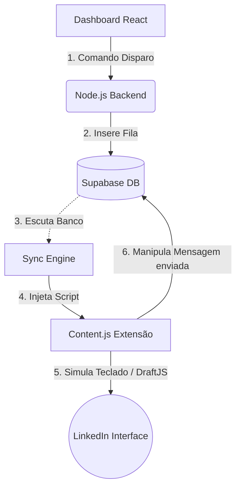
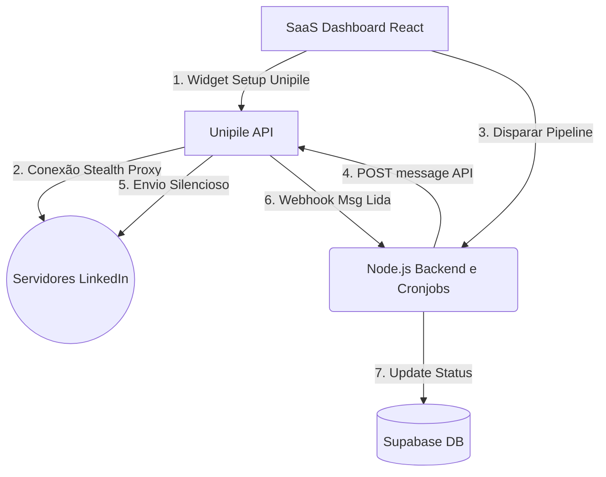

# Transformação da Arquitetura CROMOSIT Prospector

## Visão Geral: De Local-First para Cloud-Centric (API Unipile)

Para migrar a nossa arquitetura baseada em **Extensão de Chrome (RPA)** para uma integração invisível e de servidor usando **API Unipile**, apresentamos abaixo o desenho estrutural das mudanças e o passo a passo para orquestrar essa reengenharia.

---

## 1. Como é Hoje (V1.3.x) - Modelo Extension RPA

Nesse formato tudo do ciclo de vida das requisições ocorre através da extensão carregada na aba do perfil do usuário.



---

## 2. Como Será (V2.0.x) - Modelo Unipile API

A Extensão sai de cena para envio. Tudo roda sem abas, até na madrugada. O usuário pode conectar a conta escaneando ou fazendo login pela Unipile dentro do seu App de React.



---

## 3. RoadMap de Transição Prático

**Passo A: O Adeus à Extensão no Disparo**
A nossa pasta `01_DEV/extension/content.js` manteria toda genialidade e robustez que fizemos, porém nós retiraríamos dela a obrigação de "Enviar as Mensagens", voltando essa extensão apenas para a *extração de Busca Massiva* onde ser RPA ainda é extremamente vantajoso ante APIs bloqueantes.

**Passo B: Conexão via OAuth no Client** 
No seu Frontend (`Leads.jsx`):
1. Botão **"Conectar LinkedIn na Nuvem"**. Abre o Widget da Unipile.
2. A inteligência da API recupera e unifica sessões sem dor de cabeça no React.
3. Isso devolve o `account_id` e você armazena no campo da Empresa/Usuário dentro do **Supabase**.

**Passo C: Refatoração do Backend Node (`backend/routes/leads.js`)**
O Backend vira o chefe da automação! Em vez de ele receber passivamente do Sync Engine as coisas despachadas, agora ele vira cronjob que despacha:
```javascript
const enviarMensagem = async (lead, mensagem_texto, account_id) => {
    try {
        const resposta = await axios.post(`https://api3.unipile.com/v1/messages`, {
            account_id: account_id,
            provider: "LINKEDIN",
            attendees: [{ identifier: lead.linkedin_url }], // Manda pela própria URL!
            text: mensagem_texto
        }, { headers: { "X-API-KEY": "Sua_Chave" } });
        
        // Acesso direto, sem simular o botões do mouse!
        atualizarSupabaseStatus(lead.id, 'enviado');
    } catch(e) { }
}
```

**Passo D: Webhooks - "Magia Oculta"**
Se uma das vantagens é que "O Computador Fica Desligado", seu `server.js` vai ganhar uma Rota de `POST /webhooks/unipile`.
O LinkedIn responde? A Unipile bate no seu servidor webhook escondido, processa a leitura, e fala "Samuel, o cliente XYZ acabou de responder". E seu App joga o CRM inteiro pro topo, com selos coloridos.

## Esforço Estimado para a Equipe Cromosit
* **UI de Conexão Frontend:** 1 a 2 dias (Criar widget OAuth).
* **Refatoração Node.js (Servidor envia ao invés de Extensão):** 3 dias.
* **Webhook Receive:** 2 dias.
Total: 1 Semana e meia de desenvolvimento intensivo focado no Backend e React.
