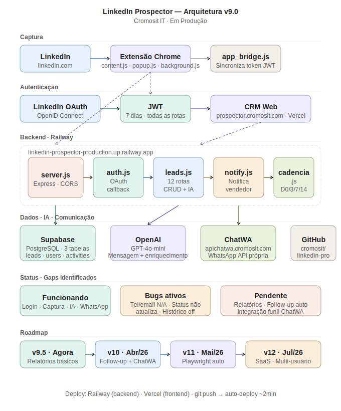

# Projeto LinkedIn Prospector – Guia de Configuração 

## Visão Geral
Este documento reúne as informações essenciais do projeto **LinkedIn Prospector** da **Cromosit IT**, incluindo a arquitetura, fluxos de dados e os ajustes realizados no **Supabase** para garantir segurança e integridade dos leads.

---

## 1. Arquitetura do Sistema 


- **Frontend** – Vite (React) executando em `http://localhost:5173` (ou `5174` na nova porta). 
- **Backend** – Express.js rodando em `http://localhost:3001` (configurado via `.env`). 
- **Supabase** – Banco PostgreSQL hospedado, responsável por armazenar usuários, leads, campanhas, tarefas e logs de LGPD. 
- **Autenticação** – JWT com rotação de tokens (`JWT_SECRET`). 
- **Integrações externas** – OpenAI (geração de mensagens), ChatWA (WhatsApp) e Unipile (monitoramento de mensagens).

---

## 2. Configuração do Supabase 
### 2.1 Schemas e Tabelas Principais
```sql
-- Tabela de Leads (principal)
CREATE TABLE IF NOT EXISTS public.leads (
    id uuid DEFAULT gen_random_uuid() PRIMARY KEY,
    name text NOT NULL,
    linkedin_url text,
    linkedin_id text,
    headline text,
    company text,
    "current_role" text,
    current_company text,
    location text,
    profile_picture text,
    email text,
    phone text,
    website text,
    about text,
    birthday text,
    connected_since text,
    followers text,
    mutual_connections text,
    connection_degree text,
    source text DEFAULT 'manual',
    temperature text DEFAULT 'frio',
    status text DEFAULT 'novo',
    notes text,
    service_interest text,
    score integer DEFAULT 0,
    ai_message text,
    assigned_to uuid REFERENCES auth.users(id),
    created_at timestamp with time zone DEFAULT now(),
    updated_at timestamp with time zone DEFAULT now(),
    contacted_at timestamp with time zone,
    next_followup_at timestamp with time zone,
    cadence_step integer DEFAULT 0,
    group_name text,
    campaign_id uuid,
    pipeline_id uuid,
    pipeline_stage_id uuid,
    stage_entered_at timestamp with time zone DEFAULT now()
);

-- Tabela de Atividades dos Leads
CREATE TABLE IF NOT EXISTS public.lead_activities (
    id uuid DEFAULT gen_random_uuid() PRIMARY KEY,
    lead_id uuid REFERENCES public.leads(id) ON DELETE CASCADE,
    user_id uuid REFERENCES auth.users(id),
    type text,
    description text,
    created_at timestamp with time zone DEFAULT now()
);

-- Tabelas auxiliares (campanhas e tarefas)
CREATE TABLE IF NOT EXISTS public.campaigns (
    id uuid DEFAULT gen_random_uuid() PRIMARY KEY,
    name text NOT NULL,
    description text,
    status text DEFAULT 'ativa',
    created_at timestamp with time zone DEFAULT now(),
    user_id uuid REFERENCES auth.users(id)
);

CREATE TABLE IF NOT EXISTS public.tasks (
    id uuid DEFAULT gen_random_uuid() PRIMARY KEY,
    user_id uuid REFERENCES auth.users(id),
    lead_id uuid REFERENCES public.leads(id) ON DELETE CASCADE,
    title text NOT NULL,
    due_date timestamp with time zone,
    status text DEFAULT 'pendente',
    priority text DEFAULT 'media',
    created_at timestamp with time zone DEFAULT now()
);
```
---
### 2.2 Índices e Constraints
```sql
-- Garantir que cada lead tenha URL única (UP‑SER T) 
ALTER TABLE public.leads
ADD CONSTRAINT leads_linkedin_url_unique UNIQUE (linkedin_url);
```
---
### 2.3 Segurança – Row‑Level Security (RLS)
```sql
-- Ativar RLS nas principais tabelas
ALTER TABLE public.leads ENABLE ROW LEVEL SECURITY;
ALTER TABLE public.lead_activities ENABLE ROW LEVEL SECURITY;
ALTER TABLE public.campaigns ENABLE ROW LEVEL SECURITY;
ALTER TABLE public.tasks ENABLE ROW LEVEL SECURITY;

-- Políticas que isolam os dados por usuário (auth.uid())
CREATE POLICY "Leads: owner only" ON public.leads FOR ALL USING (auth.uid() = assigned_to);
CREATE POLICY "Activities: owner only" ON public.lead_activities FOR ALL USING (auth.uid() = user_id);
CREATE POLICY "Campaigns: owner only" ON public.campaigns FOR ALL USING (auth.uid() = user_id);
CREATE POLICY "Tasks: owner only" ON public.tasks FOR ALL USING (auth.uid() = user_id);
```
> **Nota:** Durante a fase de *bootstrap* (primeiro carregamento de leads) a RLS foi temporariamente desativada, a importação foi executada e, em seguida, a segurança foi reativada.

---
## 3. Scripts de Bootstrap 
### 3.1 Importação de Leads de Elite
```bash
cd C:/Users/Samuel/PROJETO AI 2026/02 - linkedin-prospector/01_DEV/backend
npm install   # garante @supabase/supabase-js
node import_leads_elite.js
```
Este script usa **upsert** com a constraint `linkedin_url` para evitar duplicação.

---
## 4. Variáveis de Ambiente (.env)
```dotenv
PORT=3001
NODE_ENV=development
SUPABASE_URL=https://lquwlzqkcqtepzlxrcmu.supabase.co
SUPABASE_KEY=eyJhbGciOiJIUzI1NiIsInR5cCI6IkpXVCJ9.eyJpc3MiOiJzdXBhYmFzZSIsInJlZiI6ImxxdXdzen... (chave anon)
JWT_SECRET=cromosit_master_key_2026

# APIs Terceiras
OPENAI_API_KEY=sk-proj-...
CHATWA_TOKEN=HiYooAHPQI66...
VENDEDOR_WHATSAPP=5541991719998

# LinkedIn App
LINKEDIN_CLIENT_ID=77g3jk8ld7h6tr
LINKEDIN_CLIENT_SECRET=[REDACTED_POR_SEGURANCA]
LINKEDIN_REDIRECT_URI=http://localhost:3000/auth/linkedin/callback

# URLs de Redirecionamento
FRONTEND_URL=http://localhost:5173
BACKEND_URL=http://localhost:3000

# Unipile
UNIPILE_URL=https://api38.unipile.com:16821/api/v1
UNIPILE_API_KEY_LINKEDIN=[REDACTED_POR_SEGURANCA]
UNIPILE_API_KEY_WHATSAPP=[REDACTED_POR_SEGURANCA]
```
> **Importante:** nunca versionar o `.env` com chaves reais; mantenha‑o fora do controle de versão.

---
## 5. Próximos Passos
1. **Testar a API** (`GET /api/leads`, `POST /api/leads/bulk`). 
2. **Validar o fluxo de autenticação** usando o endpoint `/auth/linkedin`. 
3. **Implementar monitoramento** (log de auditoria e LGPD) – já há a tabela `lgpd_logs` no esquema `public`.
4. **Revisar índices** (ex.: `CREATE INDEX idx_leads_company ON public.leads (company);`) caso a busca por empresa se torne frequente.

---
## 6. Referências 
- **Supabase Docs – Row‑Level Security**: https://supabase.com/docs/guides/auth/row-level-security 
- **PostgreSQL – Constraints**: https://www.postgresql.org/docs/current/ddl-constraints.html 
- **Cromosit IT – Guia de Integração** (arquivo interno `LinkedIn_Prospector_Blueprint_v10_Cromosit_2026.docx`).

---
> **Este documento deve ser incluído na pasta `Doc`** do projeto e compartilhado com a equipe de desenvolvimento. Qualquer ajuste adicional ou inclusão de novos requisitos, é só avisar!
